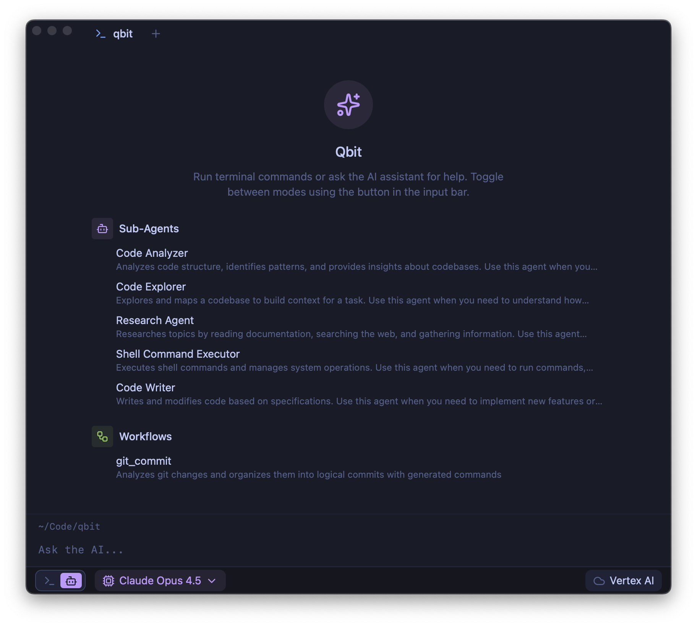

<div align="center">


# Qbit

**The open-source agentic terminal for developers who want to see how the magic works.**

[](#requirements)
[](https://www.rust-lang.org/)
[](https://tauri.app/)
[](LICENSE)

[Features](#features) • [Getting Started](#getting-started) • [Architecture](#architecture) • [Roadmap](#roadmap)

</div>

---

<div align="center">

<br>
<em>A terminal that understands your codebase — with specialized agents you can inspect and control.</em>
</div>

---

## Why Qbit?

AI coding assistants are powerful, but they're black boxes. You paste code, get answers, and hope for the best.

**Qbit flips that model.** It's a terminal with a transparent, modular agent system where you can see exactly what's happening: which agent is running, what tools it's using, and why it made each decision.

Built for developers who want AI assistance *and* understanding.

## Features

### 🤖 Specialized Sub-Agents

Not one monolithic AI — a team of focused agents, each optimized for specific tasks:

| Agent | Purpose |
|-------|---------|
| **Code Analyzer** | Analyzes structure, identifies patterns, provides codebase insights |
| **Code Explorer** | Maps and navigates codebases to build context for tasks |
| **Research Agent** | Reads docs, searches the web, gathers information |
| **Shell Command Executor** | Runs commands with security controls and allowlists |
| **Code Writer** | Implements features and modifications based on specs |

### ⚡ Composable Workflows

Chain agents together for complex tasks. The built-in `git_commit` workflow analyzes your changes and generates logical, well-organized commits automatically.

### 🔧 Bring Your Own Model

Currently supports **Anthropic Claude via Vertex AI**. More providers coming soon:

| Provider | Status |
|----------|--------|
| Anthropic (Vertex AI) | ✅ Supported |
| Anthropic (Direct API) | 🚧 In Progress |
| OpenAI | 🚧 In Progress |
| Google Gemini | 🚧 In Progress |
| OpenRouter | 🚧 In Progress |

### 📦 Modern Terminal Features

- **Command Blocks** — Output organized into collapsible blocks with exit codes and timing
- **Multi-Tab Sessions** — Independent PTY per tab (`Cmd+T`)
- **Shell Integration** — Automatic command detection via OSC 133
- **GPU Accelerated** — Smooth rendering powered by xterm.js

## Getting Started

### Requirements

- macOS (Linux support planned)
- Node.js 18+
- pnpm
- Rust 1.70+
- zsh

### Build & Run

```bash
# Clone the repo
git clone https://github.com/qbit-ai/qbit.git
cd qbit

# Install dependencies
pnpm install

# Run in development mode
pnpm tauri dev
```

### Configure AI

Qbit currently uses Anthropic Claude via **Vertex AI**.

1. Set up [Vertex AI credentials](https://cloud.google.com/vertex-ai/docs/authentication) for your GCP project

2. Copy the environment template and configure:
   ```bash
   cp .env.example .env
   ```

3. Select your model from the dropdown in the bottom bar

> **Note:** Direct API support for Anthropic, OpenAI, Gemini, and OpenRouter is in active development.

## Architecture

```
qbit/
├── src/                    # React frontend
│   ├── components/         # UI components (shadcn + custom)
│   └── stores/             # Zustand state management
└── src-tauri/src/          # Rust backend
    ├── terminal/           # PTY management, OSC parsing
    └── ai/                 # Agent system, tools, workflows
```

### Tech Stack

| Layer | Technology |
|-------|------------|
| Framework | [Tauri 2](https://tauri.app) |
| Frontend | React 19, TypeScript, Vite, Tailwind v4 |
| State | Zustand |
| Terminal | xterm.js, portable-pty, vte |
| AI Core | [rig](https://github.com/0xPlaygrounds/rig), [vtcode](https://github.com/vinhnx/vtcode) |
| Orchestration | [graph-flow](https://github.com/jkhoel/graph-flow) |
| UI Components | [shadcn/ui](https://ui.shadcn.com) |

### AI Tooling

Powered by [vtcode](https://github.com/vinhnx/vtcode), the agent has access to:

- **File Operations** — Read, write, refactor with unified diff output
- **Code Analysis** — Semantic understanding via Tree-sitter (Rust, Python, TypeScript, Go, Java, Swift)
- **Shell Execution** — Controlled command execution with security allowlists
- **Context Management** — Smart token budgeting for efficient LLM usage
- **MCP Support** — Extend capabilities with Model Context Protocol tools

All tools run with workspace isolation and audit logging.

## Roadmap

| Feature | Status |
|---------|--------|
| PTY + multi-session | ✅ Done |
| Command blocks UI | ✅ Done |
| Shell integration (OSC 133) | ✅ Done |
| AI agentic loop | ✅ Done |
| Sub-agent system | ✅ Done |
| Composable workflows | ✅ Done |
| Interactive commands (vim, htop) | 🚧 In Progress |
| Multi-provider support (OpenAI, Gemini, etc.) | 🚧 In Progress |
| Downloadable releases | 📋 Planned |
| Linux support | 📋 Planned |
| SQLite persistence | 📋 Planned |
| Plugin system | 📋 Planned |
| Custom keybindings | 📋 Planned |
| Theme engine | 📋 Planned |

## Contributing

Qbit is early-stage and moving fast. Contributions welcome.

```bash
# Lint and format
pnpm check:fix

# Run tests
pnpm test
```

## License

MIT — use it, fork it, make it yours.

---

<div align="center">

**[⬆ Back to top](#qbit)**

</div>
